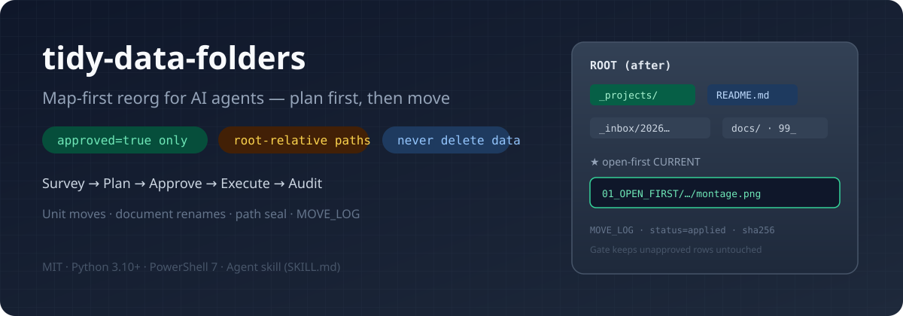
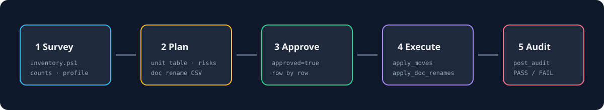
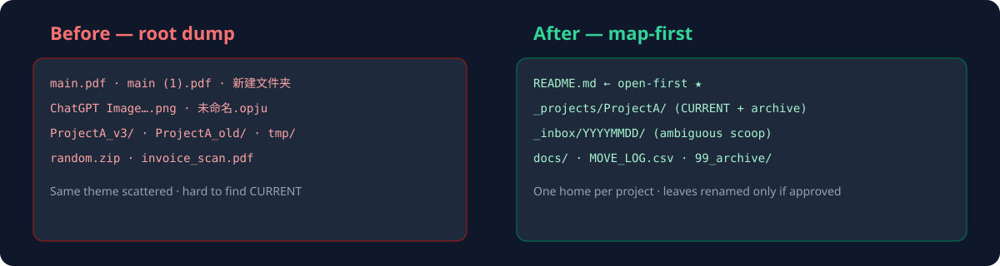

# tidy-data-folders

[](https://github.com/D-sudoasd/tidy-data-folders/actions/workflows/ci.yml)
[](LICENSE)
[](https://www.python.org/)
[](https://github.com/PowerShell/PowerShell)
[](https://github.com/D-sudoasd/tidy-data-folders/releases)

**Safe, auditable folder reorganization for people and AI agents.** Inspect first, approve exact rows, preview, execute, and audit.

[中文说明](README.zh-CN.md) · [Command-line guide](docs/CLI.md) · [Agent/contributor guide](AGENTS.md) · [Safety](docs/SAFETY.md) · [Architecture](docs/ARCHITECTURE.md) · [Changelog](CHANGELOG.md)

<p align="center">
  
</p>

Scientific workspaces, document collections, and desktop dumps often develop the same problems: too many files at the root, one project split across several folders, ambiguous document names, and moves that leave no reliable record.

`tidy-data-folders` provides a bounded workflow:

```text
survey → plan → approve selected rows → preview → execute → audit
```

The project keeps data-file deletion out of the normal workflow, preserves deep scientific leaf names by default, accepts only root-relative planned paths, and records applied operations in a unified move log.

## Choose your entry point

| You are… | Start here |
|---|---|
| Using an AI agent to organize a folder | Install the repository as a skill, then let the agent read [`SKILL.md`](SKILL.md) |
| Running the workflow yourself | Use the unified launcher in [`docs/CLI.md`](docs/CLI.md) |
| Integrating or maintaining the project | Read [`AGENTS.md`](AGENTS.md), then [`docs/ARCHITECTURE.md`](docs/ARCHITECTURE.md) |
| Auditing safety behavior | Read [`docs/SAFETY.md`](docs/SAFETY.md) and the tests in [`tests/`](tests/) |

## Install

### Clone for command-line use

```powershell
git clone https://github.com/D-sudoasd/tidy-data-folders.git
cd tidy-data-folders
python scripts/tidy.py doctor
```

On Windows, `py -3` can replace `python`.

### Grok / local agent skills

```powershell
git clone https://github.com/D-sudoasd/tidy-data-folders.git "$env:USERPROFILE\.grok\skills\tidy-data-folders"
```

### Codex

```powershell
git clone https://github.com/D-sudoasd/tidy-data-folders.git "$env:USERPROFILE\.codex\skills\tidy-data-folders"
```

Already installed as a git clone? Run `git pull` inside that folder.

### Optional document extractors

```powershell
pip install -r requirements.txt
```

| Package | Adds |
|---|---|
| `pypdf` | PDF metadata and text signals |
| `python-docx` | DOCX metadata and text signals |
| `python-pptx` | PPTX metadata signals |

Inventory and unit moves do not depend on these packages.

## Safe start for a folder reorganization

Set the repository and target folder paths:

```powershell
$Tidy = "D:\tools\tidy-data-folders"
$Root = "D:\work\messy-project"
```

### 1. Check the environment

```powershell
python "$Tidy\scripts\tidy.py" doctor
```

### 2. Survey without changing files

```powershell
python "$Tidy\scripts\tidy.py" survey --root $Root
```

Agents and other tools can request JSON:

```powershell
python "$Tidy\scripts\tidy.py" survey --root $Root --json
```

### 3. Create and edit a unit-plan template

```powershell
python "$Tidy\scripts\tidy.py" init-unit-plan --root $Root
```

This writes `docs/unit_plan.csv` with one `approved=false` placeholder row. Replace or delete the placeholder, add one row per coherent file/directory move, and keep every row unapproved during review.

```csv
plan_version,plan_id,row_id,approved,src,dst,kind,reason
1,cleanup-01,1,false,inbox/sample_A,01_projects/sample_A,move,group one project tree
```

### 4. Preview accepted rows

After changing only accepted rows to `approved=true`:

```powershell
python "$Tidy\scripts\tidy.py" apply-moves `
  --root $Root `
  --plan "docs\unit_plan.csv"
```

`apply-moves` defaults to preview. It invokes the existing full preflight and prints what would happen.

### 5. Execute

```powershell
python "$Tidy\scripts\tidy.py" apply-moves `
  --root $Root `
  --plan "docs\unit_plan.csv" `
  --execute
```

Execution requires both conditions:

- the plan row has `approved=true`
- the command includes `--execute`

The second condition does not bypass the first.

### 6. Preview empty-directory cleanup and audit

```powershell
python "$Tidy\scripts\tidy.py" sweep `
  --root $Root `
  --move-log "$Root\MOVE_LOG_YYYYMMDD_tidy.csv"

python "$Tidy\scripts\tidy.py" audit `
  --root $Root `
  --move-log "$Root\MOVE_LOG_YYYYMMDD_tidy.csv" `
  --require-readme
```

Add `--execute` to `sweep` only after its preview is correct. The unified launcher limits cleanup to empty parents evidenced by the applied move log.

## Document identification and rename planning

Create an unapproved plan for PDFs, DOCX, files, and supported document types:

```powershell
python "$Tidy\scripts\tidy.py" plan-docs --root $Root
```

Default behavior:

- writes `docs/DOC_RENAME_PLAN.csv`
- keeps all `approved` values `false`
- stores metadata in a temporary JSONL file and removes it after planning
- does not persist document text snippets
- sends low-confidence items to review or `to_sort` according to the selected layout

Preview approved actions:

```powershell
python "$Tidy\scripts\tidy.py" apply-docs `
  --root $Root `
  --plan "docs\DOC_RENAME_PLAN.csv"
```

Execute after review:

```powershell
python "$Tidy\scripts\tidy.py" apply-docs `
  --root $Root `
  --plan "docs\DOC_RENAME_PLAN.csv" `
  --execute
```

See [`docs/CLI.md`](docs/CLI.md) for profiles, metadata retention, exact plan binding, audit options, path behavior, and exit codes.

## What the workflow protects

| Risk | Protection |
|---|---|
| Moving before understanding the tree | Survey and plan stages precede execution |
| Applying every CSV row | Only `approved=true` rows are eligible |
| Accidental execution | Unified mutation commands default to preview |
| Absolute paths or parent-directory escape | Plans accept root-relative paths; absolute, UNC, and `..` paths are rejected |
| Partial changes caused by a bad plan | All approved jobs are preflighted before the first move |
| Overwriting an existing destination | Apply tools refuse an existing destination |
| Applying a stale document plan | Approved document actions verify size and full SHA-256 |
| Silent operations | Applied work is written to a 12-column `MOVE_LOG` |
| Automated duplicate deletion | Data files are never auto-deleted |
| Broad empty-directory deletion | Normal sweep is scoped to parents evidenced by the plan/log |

<p align="center">
  
</p>

## Before and after

<p align="center">
  
</p>

The target layout is **map-first**: the root should tell a person where to go in under a minute. Whole coherent trees are treated as **unit moves**, current outputs are placed where the root map can point to them directly, and historical material stays available without competing with current work.

## Modes and profiles

| Mode | Result |
|---|---|
| `survey` | Inventory only |
| `plan` | Folder taxonomy, unit moves, path risks, optional document actions |
| `execute` | Approved moves/renames plus logs and maps |
| `audit` | Count, plan, log, placement, and open-first checks |
| `docs-identify` / `rename-docs` | Document identity workflow without a full folder reorganization |
| `desktop` | Desktop/Downloads intake into dated buckets |

Profiles provide domain-specific folder recommendations while the safety engine stays the same:

`generic` · `literature-dump` · `desktop-dump` · `manuscript-heavy` · `sxrd-texture` · `sxrd-tensile`

See [`references/profiles.md`](references/profiles.md).

## Public commands and low-level scripts

The unified launcher is the recommended public interface:

```powershell
python scripts/tidy.py --help
python scripts/tidy.py guide
```

The launcher delegates execution to the hardened scripts:

| Script | Responsibility |
|---|---|
| `inventory.ps1` | File counts, extension histogram, profile hints |
| `apply_moves.ps1` | Approved unit moves with full preflight |
| `extract_doc_meta.py` | PDF/DOCX/PPTX metadata JSONL |
| `propose_doc_renames.py` | Unapproved document plan CSV |
| `apply_doc_renames.py` | Approved document actions with SHA checks |
| `empty_shell_sweep.ps1` | Empty parents evidenced by applied work |
| `post_audit.ps1` | Count, plan/log, placement, and map checks |
| `scan_path_refs.ps1` | References to paths affected by moves |
| `path_safety.py` | Shared Python path, action, hash, and log rules |

Full low-level parameters: [`docs/SCRIPT_INDEX.md`](docs/SCRIPT_INDEX.md).

## Safety boundaries

Read [`docs/SAFETY.md`](docs/SAFETY.md) before using the tool on important data. Engineering hardening notes are in [`HARDENING_20260725b.md`](HARDENING_20260725b.md).

Supported behavior includes bounded moves/renames under one selected root, approval gates, previews, logs, and audits. Current limits include cloud-sync recovery, binary editing of Origin `.opju`, universal path rewriting, cross-volume transactions, and automatic recovery of external references.

The tool can move files after explicit execution. Keep an independent backup for irreplaceable data and run the preview first.

## Tests

```powershell
python -m unittest discover -s tests -v
python -m py_compile scripts/tidy.py
python scripts/tidy.py --help
```

CI runs the unit tests on Python 3.10–3.12.

## Repository map

```text
SKILL.md                  Agent workflow and hard rules
AGENTS.md                 Fast orientation for agents and contributors
README.md · README.zh-CN.md
scripts/tidy.py           Unified preview-default launcher
scripts/                   PowerShell and Python execution tools
docs/CLI.md               Human command-line guide
docs/                     Architecture, safety, script index
references/               Profiles, naming, templates, domain lessons
examples/                 Synthetic demo tree and sample plan
tests/                    Safety and launcher tests
```

## FAQ

**Will it delete my data files?**  
No automatic data-file deletion is implemented. Empty directories can be removed through the scoped sweep after preview.

**Can it run without an AI agent?**  
Yes. `scripts/tidy.py` supports the full command-line workflow.

**Can an AI agent consume structured output?**  
Yes. `doctor --json` and `survey --json` provide machine-readable discovery and inventory. Plan CSV and `MOVE_LOG` schemas are documented in [`AGENTS.md`](AGENTS.md).

## Is it Windows-only?**  
The PowerShell layer targets Windows paths and reparse behavior through PowerShell 7. Python document tools are portable. Full unit-move and audit coverage currently expects `pwsh`.

## Where do personal defaults go?**  
Copy `USER.example.md` to local `USER.md`, which is ignored by git. Do not commit personal paths.

## Contributing

Read [`CONTRIBUTING.md`](CONTRIBUTING.md) and [`AGENTS.md`](AGENTS.md). Security reports follow [`SECURITY.md`](SECURITY.md).

## License

[MIT](LICENSE) © 2026 Delun Gong
